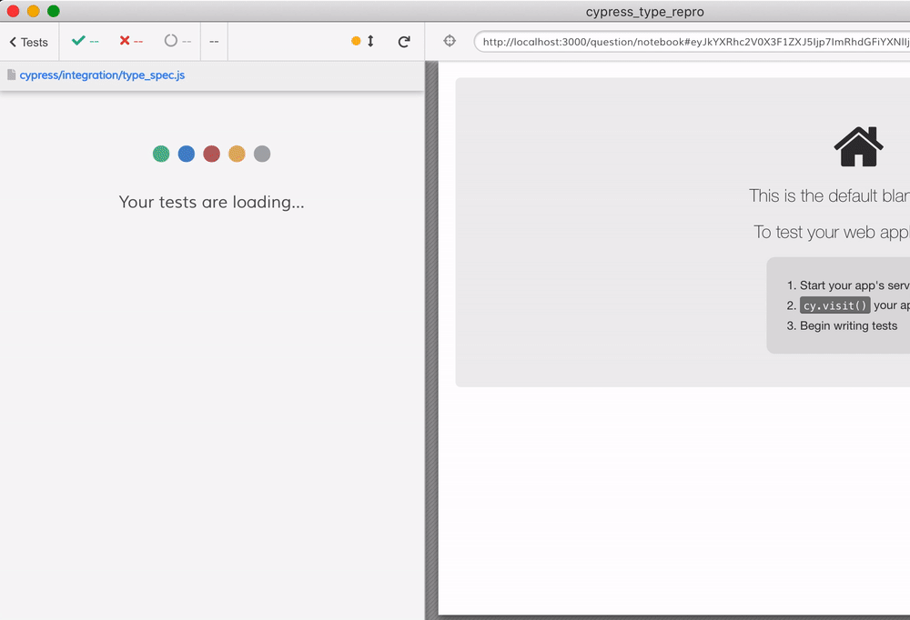

# Cypress type() repro

## Install cypress

`npm install`

Installs Cypress 5.2.0 and [`@testing-library/cypress`](https://testing-library.com/docs/cypress-testing-library/intro).

## Get Metabase up and running

```shell
docker run --rm -p 3000:3000 --name metabase metabase/metabase:v0.36.4
```

## Run Cypress

```shell
$(npm bin)/cypress open
```

## Run the type test

`type_spec.js` has both a failing and successful test case for typing into a field.

The test will provision your Metabase instance the first time you run it.

## Notes

- if the test _just types_ without going to another field we can see the text

```js
cy.get("[contenteditable='true']").type("1+1+1+1+1+1");
cy.findByPlaceholderText("Something nice and descriptive")
```


- note that the input element formats the numbers when losing the focus


- the text disappears when we have click command

```js
```js
cy.get("[contenteditable='true']").type("1+1+1+1+1+1");
cy.findByPlaceholderText("Something nice and descriptive")
  .click()
```



- this is not due to testing library command, this also loses entered text

```js
cy.get("[contenteditable='true']").type("1+1+1+1+1+1");
cy.get('input.my1').click()
```
